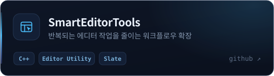
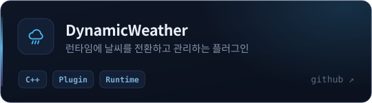
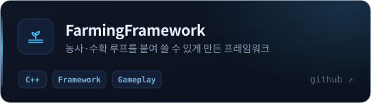
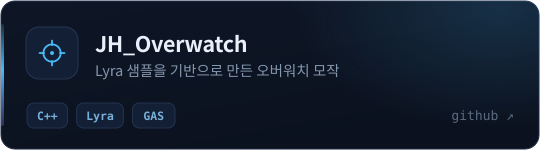
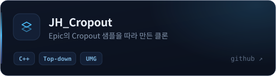
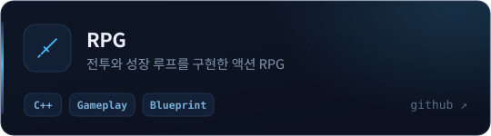

 

언리얼 클라이언트 개발자입니다.

 

## 만든 것들

나머지는 [저장소 목록](https://github.com/Junghyeon0710?tab=repositories)에 있습니다.

 

## Fab

에디터 툴과 플러그인은 [Fab](https://www.fab.com/sellers/SELLER_NAME)에 올리고 있습니다.

 

## 쓰는 것들

|  |  |
|:--|:--|
| **Language** |    |
| **Engine** |     |
| **Game AI** |      |
| **AI 도구** |     |
| **Tool** |     |

 

 
 

---

[블로그](https://iiii4.tistory.com) · [Fab](https://www.fab.com/sellers/SELLER_NAME) · [sie08357@gmail.com](mailto:sie08357@gmail.com)
